## Assignment 04 Report
Diffusion Models for High-Resolution Image Generation & Reconstruction (DDPM)

### Course
Generative AI (AI4009) — Spring 2026

### Group members
- Ali Hassan (22F-3377)
- Bilal Nadeem (22F-3845)

### Objective
Build a denoising diffusion probabilistic model (DDPM) from scratch in PyTorch to:
- simulate the forward (noising) process
- learn the reverse (denoising) process using a simplified U-Net
- generate new images from pure noise
- reconstruct a target image via reverse diffusion
- report quantitative metrics (PSNR, SSIM)
- deploy a small interactive app (Gradio)

Dataset used: CelebA-HQ 256 (images only) on Kaggle.

---

## 1. Environment and setup (Kaggle)
- Platform: Kaggle notebook
- Accelerator: GPU (T4 ×2 supported via `torch.nn.DataParallel`)
- Implementation constraint: base PyTorch only (no pretrained diffusion pipelines, no HuggingFace diffusers)

Key libraries:
- PyTorch + torchvision (model, data, training)
- matplotlib (plots)
- Gradio (app deployment)

---

## 2. Data preprocessing and dataloader
### Preprocessing
Images are converted to a consistent shape and normalized for stable training:
- resize and center-crop to 128×128
- convert to tensor in \([0,1]\)
- normalize to \([-1,1]\) using mean = 0.5 and std = 0.5 per channel

This range is standard for diffusion training because it keeps values bounded and symmetric around 0.

### Dataloader
- batch size: 32
- shuffle: enabled
- pin memory: enabled (GPU throughput)

### Sample batch visualization
The following figure confirms that images are loaded correctly and preprocessing preserves face structure.

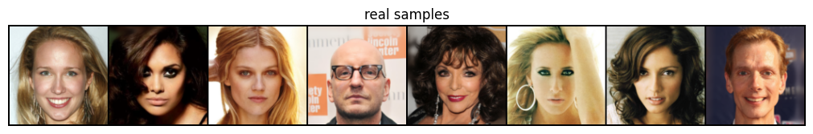

---

## 3. Forward diffusion (noising process)
### Noise schedule
A linear beta schedule was used:
- \(\beta_t\) increases linearly from \(1e{-4}\) to \(0.02\)
- \(\alpha_t = 1 - \beta_t\)
- \(\bar\\alpha_t = \prod_{i=1}^{t} \alpha_i\)

### Forward noising equation
For a clean image \(x_0\), the noisy image at timestep \(t\) is sampled as:

\[
x_t = \\sqrt{\\bar\\alpha_t} x_0 + \\sqrt{1-\\bar\\alpha_t}\\, \\epsilon, \\quad \\epsilon \\sim \\mathcal{N}(0, I)
\]

### Visualizing the noising steps
The figure below shows the same image at 6 timesteps. As \(t\) increases, structure gradually disappears and becomes near-random noise.

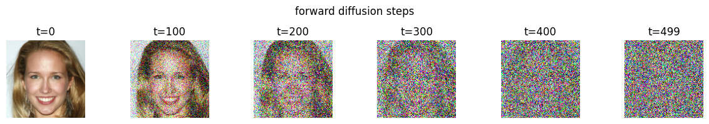

Observation:
- at small \(t\): identity and edges still visible
- at large \(t\): the sample is essentially pure Gaussian noise

This verifies the forward diffusion implementation is correct.

---

## 4. Reverse diffusion model (U-Net)
### Goal of the network
The reverse process is learned by predicting the noise \(\epsilon\) injected at timestep \(t\).

Network input:
- noisy image \(x_t\)
- timestep \(t\) (embedded using sinusoidal time embeddings)

Network output:
- predicted noise \(\hat\\epsilon_\\theta(x_t, t)\)

### Architecture summary (simplified U-Net)
The U-Net follows the assignment constraints:
- channel progression: 64 → 128 → 256
- residual blocks in each stage
- timestep embeddings injected into residual blocks
- downsampling and upsampling layers implemented directly
- a self-attention block at the bottleneck for global context

Why time embeddings matter:
- the denoising function changes with noise level
- the model must know whether it is denoising a lightly corrupted image or almost pure noise

---

## 5. Training setup
### Training objective (MSE on noise)
DDPM training is done by sampling a random timestep \(t\) and noise \(\epsilon\), creating \(x_t\), then minimizing:

\[
\\mathcal{L} = \\mathbb{E}_{x_0, t, \\epsilon} \\left[ \\| \\epsilon - \\hat\\epsilon_\\theta(x_t, t) \\|_2^2 \\right]
\]

This matches the assignment’s required loss function (MSE).

### Optimizer and stability techniques
- AdamW optimizer
- cosine annealing scheduler
- mixed precision training (AMP)
- gradient clipping (\(\\|g\\| \\le 1.0\))
- EMA (exponential moving average) of weights for improved sampling stability

### Training logs (epoch average loss)
Extracted from Kaggle run:
- epoch 1: 0.1764
- epoch 2: 0.0523
- epoch 3: 0.0450
- epoch 4: 0.0352
- epoch 5: 0.0317
- epoch 6: 0.0312
- epoch 7: 0.0280
- epoch 8: 0.0265
- epoch 9: 0.0272
- epoch 10: 0.0261
- epoch 11: 0.0247
- epoch 12: 0.0245
- epoch 13: 0.0233
- epoch 14: 0.0234
- epoch 15: 0.0242
- epoch 16: 0.0216
- epoch 17: 0.0213
- epoch 18: 0.0211
- epoch 19: 0.0215
- epoch 20: 0.0218
- epoch 21: 0.0204
- epoch 22: 0.0208
- epoch 23: 0.0202
- epoch 24: 0.0214
- epoch 25: 0.0223
- epoch 26: 0.0210
- epoch 27: 0.0216
- epoch 28: 0.0200
- epoch 29: 0.0201
- epoch 30: 0.0208

### Loss curve plot

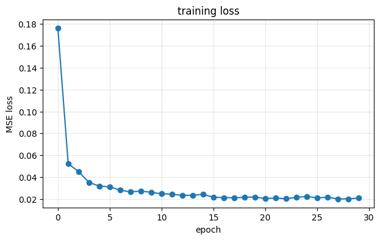

Interpretation:
- sharp drop in early epochs: model quickly learns denoising for low-noise cases
- later plateau: additional training is needed to master higher-noise timesteps and produce sharper samples

---

## 6. Image generation (from pure noise)
### Sampling procedure (DDPM)
Generation starts from pure Gaussian noise:
- \(x_T \\sim \\mathcal{N}(0, I)\)
- repeatedly apply the learned reverse step from \(t=T-1\\) to 0

The implementation uses the standard DDPM mean update with Gaussian noise injected at each step (except the last).

### Generated samples

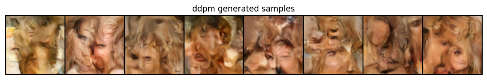

Observation:
- samples show face-like global textures and colors
- structure is partially learned but remains blurry and distorted

This is consistent with limited training steps and a compact network at 128×128.

---

## 7. Reverse diffusion visualization (intermediate denoising steps)
To demonstrate the reverse process, intermediate outputs are captured at multiple timesteps.

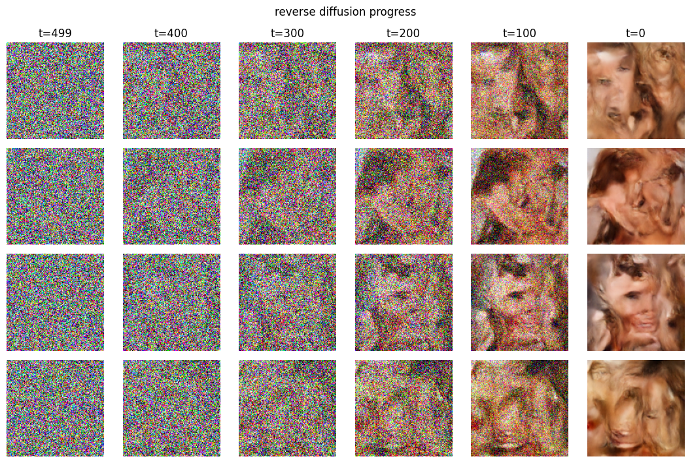

What this figure shows:
- early steps (high \(t\)) are mostly noise
- structure begins to form later, closer to \(t=0\)
- final outputs have more recognizable facial patterns, but still lack sharpness

This satisfies the assignment requirement to show intermediate reverse steps.

---

## 8. Image reconstruction task (core requirement)
### Goal
Given a target image:
- start from random noise version of that image (at a chosen noise level)
- run reverse diffusion to recover a sample resembling the target

### Target vs reconstructed comparison

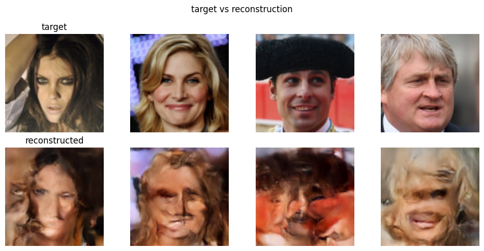

Interpretation:
- the reconstruction preserves broad color layout and some facial landmarks
- identity is not fully preserved; reconstructions drift toward the model’s learned “average face”

This behavior is typical when:
- the denoiser is not trained long enough across all timesteps, and/or
- the model capacity is limited for the chosen resolution

---

## 9. Quantitative evaluation (PSNR and SSIM)
Metrics were computed between target images and reconstructed images after converting from \([-1,1]\) back to \([0,1]\).

Reported results:
- PSNR per image: 17.53, 16.58, 16.82, 17.84
- mean PSNR: 17.19 dB
- SSIM per image: 0.470, 0.441, 0.429, 0.443
- mean SSIM: 0.446

How to read these:
- PSNR near 17 dB indicates noticeable reconstruction error at pixel level
- SSIM near 0.45 indicates low structural similarity, matching the visual differences seen in the reconstruction figure

---

## 10. Side-by-side comparison (target vs generated)
This section compares real target faces with newly generated outputs (not conditioned on the target).

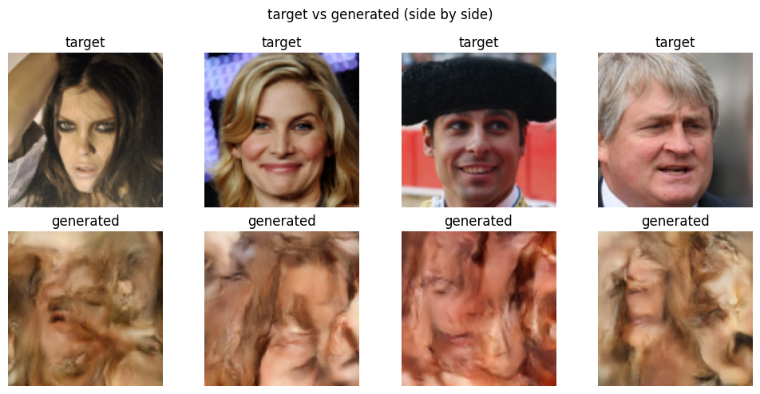

Key takeaway:
- generated images have plausible “face-like” textures
- they are not expected to match the targets (unconditional generation), so the bottom row differs strongly from the top row

---

## 11. App deployment (Gradio)
A Gradio interface is included to satisfy the deployment requirement:
- start from random noise
- generate an image
- show intermediate denoising steps as a gallery

The app exposes:
- number of intermediate frames
- random seed for reproducibility

This demonstrates end-to-end usage without external tools.

---

## BONUS TASK (clearly labeled)

### Bonus 1: improved sampling with DDIM (faster generation)
DDIM reduces the number of sampling steps (e.g., 50 instead of 500) while producing comparable quality.

Timing reported on Kaggle:
- DDPM (500 steps): 20.0 s
- DDIM (50 steps): 2.1 s
- speedup: 9.5×

Visual comparison:

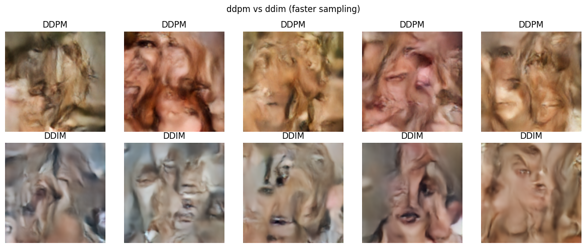

Observation:
- DDIM is significantly faster
- output quality remains similar in this training regime

### Bonus 2: cosine noise schedule comparison
We compare linear vs cosine schedules:
- beta schedule curve
- cumulative product \(\\bar\\alpha_t\)
- forward noising visuals at multiple timesteps

Schedule plots:

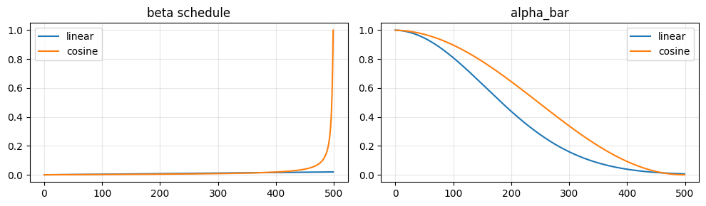

Noising comparison (linear vs cosine):

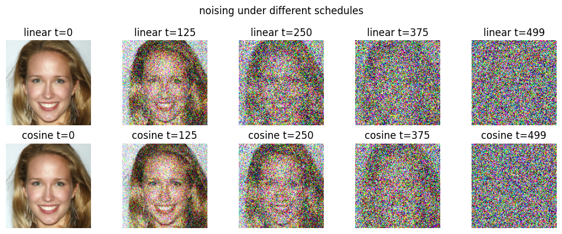

Practical note:
- cosine schedules typically keep more signal in earlier steps and can improve training/sampling behavior depending on model size and training time

### Bonus 3: 256×256 sampling demonstration
Because the U-Net is convolutional, it can be applied at higher spatial sizes at sampling time.

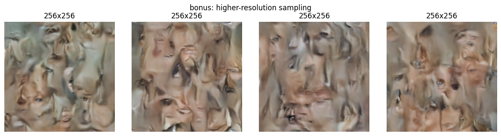

Observation:
- larger outputs are achievable
- fine detail is limited without training directly at 256×256

---

## 12. Conclusion
This assignment implemented a DDPM pipeline from scratch:
- verified correct forward diffusion (noise gradually destroys the image)
- trained a time-conditioned U-Net denoiser with AMP, EMA, and stable optimization
- generated new images from noise and visualized intermediate denoising steps
- performed reconstruction and evaluated with PSNR/SSIM
- deployed an interactive Gradio demo

The provided outputs show that the system learns meaningful structure (face-like patterns) but requires more training steps and/or higher model capacity for sharper, higher-fidelity samples at 128×128 and above.

